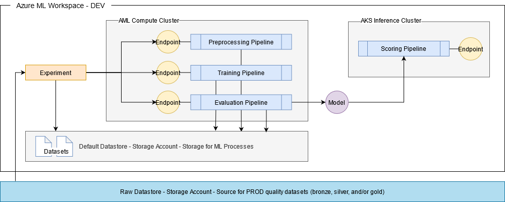
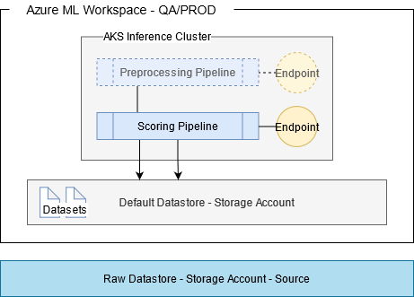

# MLOps

## Azure ML Workspace

### Required resources:

1. Key Vault
4. Container Registry
2. Application Insights
3. Storage Account

### Key Vault

MLOps can share KeyVault resource.  KeyVault names are global.

### Storage Account

Use general purpose v2 storage account. Storage account names are global. MLOps will use its own storage account for storing:

1. Pipeline generated artifacts such as:
    1. logs
    1. model pickle files
    1. pipeline data
2. Registered datasets

### Application Insights

Application Insights allows monitoring of applications running inside containers. This would be used by Azure ML Pipelines running in Azure container instances (ACI) or in Azure Kubernetes Service (AKS).

### Container Registry

Container Registry is an optional component in an MLOps project. It will be needed only when the ml ops process requires creating its own custom container image. Container registry can be shared.

## Azure ML Workspace Architecture

Azure ML Workspace is needed on all environments dev, qa and prod. Dev is primarily for experimentation and training. QA and Prod are primarily for serving preprocessing (optional) and scoring endpoints. All environments should have access to raw data sources that have PROD-quality data. If these data sources are found in prod storage accounts, or storage accounts in other resource groups or subscriptions, then these storage accounts must be added as a datastore in Azure ML Workspace.

### Dev Workspace

In the dev workspace, experiments are conducted in compute instances to provide sufficient resources for processing data in a small to medium scale. Large scale data processing and training run on compute clusters. Pipelines with endpoints can be setup to allow triggering of these pipelines from within experiments or within cicd pipelines. Scoring pipelines can be deployed in dev for the purpose of testing.

#### Dev pipelines

1. Preprocessing 

    Preprocessing pipeline can be used to implement any processing required to take raw data and transform it into a data set ready to be passed to the training pipeline. Basically, this is the pipeline responsible for feature engineering. Make sure datasets generated are stored in the default datastore and registered.

2. Training 
    
    Training pipeline can be used to implement training using multiple algorithms and parameters (hyperparameter tuning). Make sure to use Azure ML SDK to properly register experiments, pipeline runs and logging metrics and plots generated. Models generated should be registered.

3. Evaluation 

    Evaluation pipeline can be used to compare different models generated during an experiment and select the best model. The best model selected by this pipeline can then be used as an input to the scoring pipeline.

4. Scoring

    Scoring pipeline is the pipeline that is used to predict. Scoring pipeline uses a registered model that is tagged for deployment.

### QA and Prod Workspace

QA and PROD environments are setup to include preprocessing and scoring pipelines only. Preprocessing pipelines are optional and is necessary only if client will need a way to format its raw data to a form acceptable to the model in the scoring pipeline. Datastores are defined as needed.

## Repository Directory Structure

  Documentation

    ├── README.md
    ├── docs
    │   └── images

  Experiments

    ├── experiments
    │   ├── README.md
    │   └── notebooks
    │       └── Untitled.ipynb

  Infrastructure-as-code

    ├── infra
    │   ├── config
    │   │   ├── deploy.parameters.dev.json
    │   │   ├── deploy.parameters.prod.json
    │   │   ├── deploy.parameters.qa.json
    │   │   └── workspace.cfg
    │   ├── deploy.json
    │   └── workspace.py
  
  Integration test scripts

    ├── integration_test
    │   └── test.py

  CI/CD pipelines

    ├── pipelines
    │   ├── azure-pipelines-pr-master.yaml
    │   ├── azure-pipelines-tr-master.yaml
    │   └── templates
    │       └── workspace-infra.yaml

  Python modules for project

    ├── project
    │   ├── pipeline
    │   │   ├── preprocessing
    │   │   ├── score
    │   │   └── train
    │   └── util
    │       ├── auth.py
    │       └── cfgparser.py
    └──requirements.txt

  Unit Tests for Python modules

    └── test
        ├── pipeline
        │   ├── preprocessing
        │   ├── score
        │   └── train
        └── util

## DevOps Process

